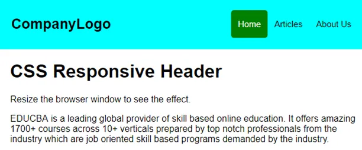
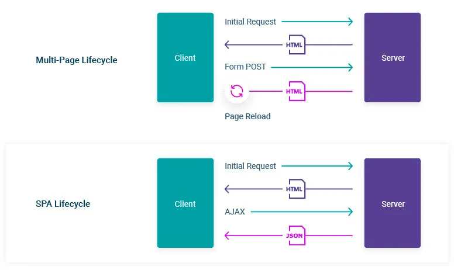
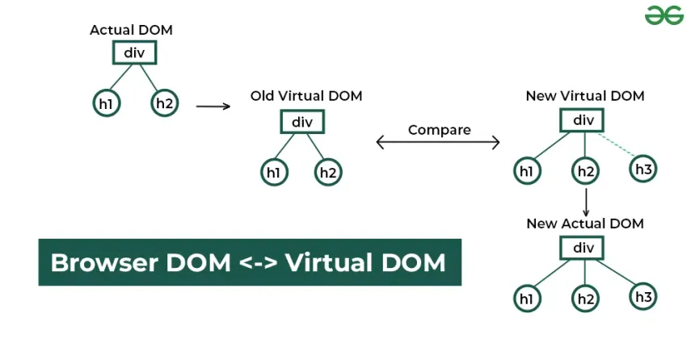

# Introduction aux frameworks frontend <!-- omit in toc -->

Ceci est une introduction aux frameworks frontends. Elle doit être comprise comme une explication de l'état des applications webs développées aujourd'hui et comme une vue d'ensemble des évolutions qui ont permi la création de nouveaux outils. Cette introduction n'est pas exhaustive.

## Sommaire <!-- omit in toc -->

- [1. Le début du web et le statique- HTML et CSS](#1-le-début-du-web-et-le-statique--html-et-css)
- [2. La venue du dynamisme - JavaScript](#2-la-venue-du-dynamisme---javascript)
- [3. Les bibliothèques - JQuery](#3-les-bibliothèques---jquery)
- [4. Le passage au backend - Nodejs](#4-le-passage-au-backend---nodejs)
- [5. Le premier framework populaire - AngularJS](#5-le-premier-framework-populaire---angularjs)
- [6. Le roi est mort, vive le roi - ReactJS](#6-le-roi-est-mort-vive-le-roi---reactjs)
- [7. You get a framework, you get a framework, everybody get a framework - VueJS, Gatsby, ...](#7-you-get-a-framework-you-get-a-framework-everybody-get-a-framework---vuejs-gatsby-)
- [8. La relève - NextJS](#8-la-relève---nextjs)
- [8. Les outsiders - Nuxtjs et Sveltekit](#8-les-outsiders---nuxtjs-et-sveltekit)
- [Conclusion](#conclusion)

## 1. Le début du web et le statique- HTML et CSS

Avec le protocole HTTP et les URL, le langage de balise HTML fait parti des 3 inventions dans le début des années 1990 qui ont permi l'essor du World Wide Web. Ce n'est pas un langage de programmation : il ne permet pas d'écrire d'algorithme ni de manipuler des données. Son seul but est d'être interprété par les navigateurs pour afficher du contenu selon les balises utilisées.

Avec l'arrivée du CSS au milieu des années 1990, on pouvait rajouter un peu de caractère et de personnalisation aux sites webs. Le CSS permettant d'influer sur les couleurs, la taille, la diposition et bien d'autre choses des éléments HTML.

## 2. La venue du dynamisme - JavaScript

JavaScript sort presque en même temps que le CSS. C'est un langage de programmation adapté au web, puisqu'originellement seul les navigateurs peuvent l'interpréter. Avec JS, il est maintenant possible de rendre une page dynamique : ajouter ou modifier des éléments en fonction des inputs de l'utilisateur, ajouter des animations, obtenir des données d'API.

## 3. Les bibliothèques - JQuery

JS a permi aux développeurs d'ajouter beaucoup de fonctionnalités aux applications. Mais il fallait tout le temps réinventer la roue, beaucoup de lignes de codes étaient nécessaires pour développer certaines fonctionnalités simples et les codebases manquaient de cohérence d'un projet à l'autre. De ce besoin sont nées les bibliothèques JS, et la plus connue d'entre elles : JQuery.

JQuery a permi de simplifier la modification du DOM (le contenu affiché par le navigateur), l'ajout d'animations, la manipulation du style et du CSS ainsi que l'envoi de requêtes asynchrones vers des API avec Ajax.

## 4. Le passage au backend - Nodejs

Initialement, le JS est un langage qui n'est utilisable que côté client, puisque seul les navigateurs peuvent l'interpréter. Mais au début des années 2010, l'arrivée de Nodejs permet d'utiliser JS côté serveur. Il est à présent possible d'écrire son backend avec JS, voir de faire tourner un site web écrit avec JS depuis un serveur. 

## 5. Le premier framework populaire - AngularJS

Angular, et sa première version nommée AngularJS, est un framework front-end mis au point par Google en 2010. Il apporte de nombreuses avancées dans le monde du front-end, comme le modèle MVC pour découpler les manipulations du DOM de la logique métier, un routeur pour faciliter la gestion des pages web, la facilité d'écrire des tests (avantage par rapport à Ember.js) et des fonctionnalités importées de Jquery (avantage par rapport à Backbone.js). 

AngularJS est également plus modulaire que d'autres frameworks JS, puisqu'il est possible de l'ajouter à certaines pages d'un site en particulier avec une balise script. On n'est pas obligé de l'utiliser dans toute l'application.

Enfin, AngularJS popularise le concept des SPA, pour Single Page Application. Jusqu'à présent, les sites webs étaient sous la forme de dossiers avec des fichiers HTML et stockés dans des serveurs. Une fois arrivé sur une URL, le navigateur télécharge le fichier HTML qui y correspond du serveur et l'interprète. Soit du SSR, pour Server Side Rendering. Avec un site en SPA, il n'y a plus qu'un seul fichier HTML pour l'entièreté du site stocké sur le serveur, et c'est un script JS qui a pour rôle de générer le contenu des pages et les transitions entre les URL. 

L'avantage est qu'on gagne en liberté de customisation : on peut mieux gérer les transitions entre les pages, voir on peut faire une application entièrement sur une page avec seulement des blocs visuels qui évoluent au fil des intéractions. On notera 2 inconvenients majeurs à cette technique. Le premier est qu'il est plus difficile de mettre en placce un SEO efficace. Comme il n'y a plus réellement de contenu HTML sur le serveur, les crawlers des navigateurs n'ont plus rien à indexer. Le second est le temps de chargement. Pour que le navigateur puisse gérer les transitions de page et les évolutions d'interface, il doit télécharger l'entièreté du site en mémoire locale, ce qui impacte lourdement les performances. Lors du premier chargement du site, la barre de chargement ne progresse pas très vite.

## 6. Le roi est mort, vive le roi - ReactJS

AngularJS a rapidement su s'imposer parmi les frameworks frontend et a grignoté des parts d'utilisation de Jquery. Mais suite à une mauvaise gestion des mises à jour, il a perdu beaucoup de sa base d'utilisateurs. En effet, le passage de la V1 (AngularJS) à la V2 (Angular 2) n'était pas fluide du tout. Il était devenu obligatoire d'utiliser uniquement Angular 2 dans son projet, on ne pouvait plus l'utiliser pour quelques pages seulement comme avec AngularJS. Beaucoup de code s'est retrouvé non maintenable, il fallait tout recommencer depuis le début. L'histoire s'est répété avec le passage de la V2 à la V4 (tellement que la maintenance était désordonnée, la V3 a été sautée). Et s'est répétée dans une moindre mesure du passage de la V4 vers la V5 et la V6.

Pendant ce temps, chez Facebook, un nouveau framework voit le jour en 2013. Il s'appelle React et promet de reprendre le concept d'Angular (MVC, SPA, fonctionnalités, performances, ...) et de l'améliorer. En termes de fonctionnalités, il met en avant le principe de composants (components en anglais). Déjà présents dans Angular, un composant est un bloc visuel d'une interface, réutilisable dans l'application et customisable. Là où un composant dans Angular est souvent un menu ou un formulaire, il peut être tout et n'importe quoi dans React. Un bouton, un paragraphe, une liste déroulante, ... En terme de performances, React opte pour un DOM virtuel. Il met en mémoire des parties de l'interface pour ne mettre à jour la page web qu'au bon moment.

Facebook met également au point un nouveau langage se basant sur JS pour son framework : JSX. On ne va plus, comme avec Angular, se retrouver avec un fichier JS pour le modèle, un fichier JS pour le controller et un fichier HTML pour la vue. Mais avec un fichier JSX avec une fonction qui va retourner le code HTML de la page. Ce qui est impossible avec du JS de base (cela pose des problèmes au niveau des mots réservés par JS, comme `class` aussi bien utilisé en HTML qu'en JS)

## 7. You get a framework, you get a framework, everybody get a framework - VueJS, Gatsby, ...

Le problème rencontré avec React et son DOM virtuel, c'est qu'on se retrouve avec de plus en plus de petits changements, et donc une mémoire de plus en plus saturée. Ajouter à cela une taille des applications exponentielles, due principalement à l'ajout de nouvelles librairies et fonctionnalités à React, et on obtient des problèmes majeurs de performance et de stabilité des applications.

De nombreux développeurs se trouvent à un dilemne. Des frameworks existent pour leur faciliter leur travail, mais ils finissent par augmenter la dette technique (Angular) ou les force à adopter des paradigmes qui au final apportent des problèmes de performance. La solution est simple : créer encore plus de frameworks.

C'est ainsi que voit le jour en 2014 VueJS, créé par un ancien développeur d'Angular de Google. C'est un framework qui se veut être une alternative à Angular, en étant plus léger et plus libre dans l'organisation de son projet. Il reprend notamment le concept d'AngularJS d'ajouter les fonctionnalités du framework page par page. On n'est pas obligé d'écrire tout son frontend avec VueJS. Il reprend aussi le concept de composants et de DOM virtuel de React.

En 2015, c'est au tour de Gatsby.js d'être disponible. Ce framework, basé sur React, permet de développer des sites statiques à partir de fichiers Markdown et des CRM (comme Wordpress ou Drupal). C'est ce que l'on appelle un SSG, pour Static Site Generator. Un outil parfait pour développer rapidement des blogs.

## 8. La relève - NextJS

NextJS est un framework développé par-dessus React pour répondre aux problèmes de performance de React. Il n'embarque que le code minimal du framework et permet de créer des sites en SSG ainsi qu'en SSR pour palier aux contraintes du SPA. Nextjs permet également de se passer d'une configuration de routeur, puisqu'il génère les URL du site en fonction de l'arborescence de fichiers du projet.

## 8. Les outsiders - Nuxtjs et Sveltekit

En voyant la popularité de NextJS, des développeurs de VueJS ont voulu créer une variante pour leur framework. Ils ont créé NuxtJS. NuxtJS reprend tous les concepts de NextJS (code minimal, routeur automatique, composants, SPA SSG et SSR) et l'adapte au framework VueJS.

EN 2016, Rich Harris développe Svelte dans le but de produire un framework qui se rapproche de l'HTML et du JS que l'on écrivait au début du Web. En cela, Svelte est davantage un compilateur qu'un framework. Il va prendre en entrée des fichiers `.svelte` et les compiler en fichiers HTML et JS purs. Il va également de nouveau s'appuyer sur le DOM des navigateurs et non pas sur le DOM virtuel pour des raisons de simplicité et de performance. En résulte des applications optimisées, légères et donc performantes. S'en suite Sveltekit, qui est à Svelte ce que NextJS est à React : un framework qui permet de livrer des applications SPA, SSR et SSG avec un routeur automatisé selon l'arborescence de fichiers.

## Conclusion

Il est aujourd'hui impossible de prédire quel framework fonctionnera dans le temps. Il est également impossible de développer un framework qui répondra à toutes les attentes et à tous les besoins imaginables. Il faudra toujours faire des concessions (sur l'écosystème, les performances, l'expérience développeur, ...). Il est important de choisir un framework en fonction de son appétence pour son expérience développeur et les contraintes techniques du projet. Il est également intéressant de tester plusieurs frameworks avec des philosophies différentes pour mieux comprendre les limites de chacun et importer les idées vers celui qu'on utilise traditionnellement.